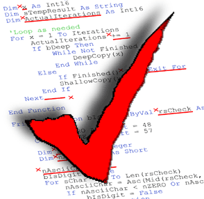

## The Idea of Coding Standards
When most people think of "coding standards", they think of it as the tedious things you learn in your intro Computer Science courses- how many spaces to indent, spaces between operators, where to properly place a closed curly brace, etc. But aside from the fact that coding standards usually make written code look more visually appealing, they also have other benefits.

### The Benefits
All the tedium of writing code that follows coding standards not only makes written code look better, but it also helps in the long term. Code written that follows standards naturally makes code better structured and helps prevent syntactic bugs. It also runs the benefit of being more reusable, as more consistent and standardized code allows for the creation of more modular and optimized functions, methods, and code blocks, which allows for it to be reused or transferred in other parts of a project or in other projects. Coding standards also are a great benefit to team collaborations, as the standard allows for everyone to be on the same page and code more effectively (having to read someone elses' code is much easier when you know they follow the same standards and formatting you do!)

#### Anecdotal Study: The ESLint Experience
In my software engineering class, I had to import and use ESLint in order to make sure my code followed the standards set by the class. At the beginning, I was not a fan of ESLint- in fact I was probably one of its biggest haters. I hated getting told that I had unused functions, methods, or variables (I was going to use them, just not yet), but most of all I hated how all the formatting errors were thrown at me. However, over time, I came to enjoy having ESLint around. After begrudgingly accepting all the fixes it wanted, I found that the code was slightly more readable. That's not to say I had bad practices in terms of formatting, but moreso the way I wrote code was definitely more compact, and not in the good way. Using ESLint, my code not only looked cleaner, but also generally had fewer minor errors (quick fixes requiring a character, a new line, etc.) than what I used to have. 

##### So why bother?
Coding standards, as much as we hate them, are a major aspect in software development. They provide consistent readable code and help reduce minor errors and typos, overall increasing the quality of the code. Implementing standards allow for better work efficiency, more reusable code, and help promote best practices. Especially in a world where more and more code can be written with the help of AI, having standardized coding practices is beneficial for software engineers of any level. 

###### Use of AI
AI in the form of Grammarly was used for proofreading purposes.
