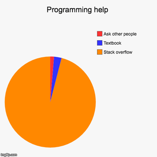

## Why Ask Smart Questions

In coding, I think we've all had a time when we were stuck on something. It could've been code that wasn't compiling correctly, or even just trying to figure out a code snippet. So we go onto Google and search up our problem. One of the first results is a Stack Overflow question that has almost the same, if not exact, wording for a problem you're having. You click on it to see the question and answer you've been waiting for,
.
.
.
and then you read the post and your hopes are dashed because the posted question was asked in a way that made it near impossible to answer (for example, they won't say what's wrong with the code or what problem they're having with their current code.) The reason we ask smart questions is to not only make it easier for others to answer, but also to make it easier for people after us, who have the same question, to find the solution.  

## What’s a smart question?

On Stack Overflow, there's a plethora of questions that one could look at. With all these questions, combined with the requirements for higher quality questions on the platform, it's no wonder that there's a joke going around with a pie graph looking like this: 



It's no wonder too, since you can find answers to virtually any question. For example,

```
Q: How do I avoid checking for nulls in Java?

I use x!= null to avoid NullPointerException. Is there an alternative?

[code snippet attached]

```

I personally find this an almost textbook "smart" question. The title is formatted with a meaningful, specific subject header ("How do I avoid checking for nulls in Java") and the question asked in the body is also short, concise, and to the point. The posting author also provides context with what they do along with an attached code snippet, to help illustrate their query. Due to the open-ended nature of the question, the author received many answers of various help [in the thread](https://stackoverflow.com/questions/271526/how-do-i-avoid-checking-for-nulls-in-java).

## The Less Smart way to ask a Question

While Stack Overflow has plenty of good questions, there's also the questions that aren't as helpful in the greater context. These are questions that are not specific in what's wrong with the code, or just generally don't seem to provide much information. Take for example, [this question](https://stackoverflow.com/questions/11586188/im-not-sure-why-this-code-wont-work). In this case, the author asks about code that they have and how they want to break it up into different classes because of how it'll work eventually. They state they can't figure out why it won't work, and then posted their code. While the author apologizes for not being able to provide useful information, they state they don't know what's going on. This is an example of a less smart question- the question isn't specific to what the problem is and the wording of the question tone seems like the author is just waiting for someone to tell them the answer.

## Conclusion

While the adage "there's no such thing as a dumb question" may be true, there is definitely a way to ask smart questions in dumb ways. The reason we ask questions in smart ways is to not only facilitate getting help, but to also provide easier answers for those with our same queries in the future.
