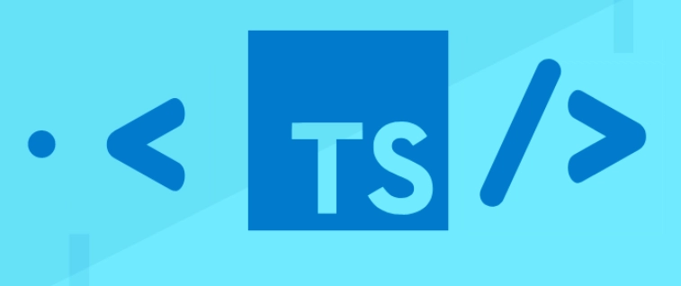

##
Learning a new language is hard. Whether it's a foreign language or a new coding language, I've always struggled with wrapping my head around the different semantics, writing rules, and general structure. In this case, with Typescript, I spent the last couple of weeks in what was essentially a crash course learning the basics. 

### My Coding Background
I have previous experience in various coding languages. In community college, I learned the basics of Python and became fairly experienced in C++. I then transferred here to the University of Hawaii, where I continued to add to my skillset by picking up Java and now Typescript. While not proficient, I feel that I have a good foundation and know the basics of this language.

#### The WODs
The class I learned Typescript in utilized an athletic software engineering approach, in which, as one of our professors put it, we would be placed under a "high-intensity, time-constrained, and often stress-inducing approach to acquiring competency with software engineering skills." It sounded scary and really stress-inducing, until I realized what it actually meant. Instead of a 'traditional' classroom where we would be learning theory and concepts, then get quizzed and tested on our knowledge of concepts, we were instead taught via a more hands-on approach, in which we were given concepts and then practiced them in our development environments (in this case, Typescript Playground). Our quizzes, also known as Workouts of the Day (or WODs), were relatively simple tasks that required us to practice both conceptual and technical skills. For example, one of our WODs was to make a simple temperature class that, given a certain temperature and humidity, returned what the temperature would 'feel like' as well as a warning on the likelyhood of heatstroke. For this, I was actually overconfident in my skills because of my previous background in other coding languages. I was fully expecting to blow through this with no problems because it seemed "close enough" to other languages. Plus, this was a very simple problem in theory. However, in practice, I found that because I didn't understand the basic language structure, I struggled to complete the WOD in a timely manner. Realizing that because I relied too much on my prior experiences in languages and not actually trying to learn Typescript, I began to put more effort into actually understanding the language. I became more competent with Typescript, and going back to old WODs served as way to see how much I've learned due to being able to finish the WOD faster, but also being able to extend more functionality to these classes using concepts learned later on. 

##### Final Thoughts
Overall, learning Typescript over these last two weeks was a lot of fun. Despite being moderately stressful, and despite the shaky start, I think I've developed a solid understanding of the language basics.  I actually found this style of teaching useful, because I prefer the hands-on approach over sitting in a lecture room listening to theory and trying to memorize concepts. I know Typescript is useful for web based applications and development, but I think I might need a little more practice before I jump into that sphere!

###### Use of AI
AI use in this essay was minimal, as it was used for grammar checking
