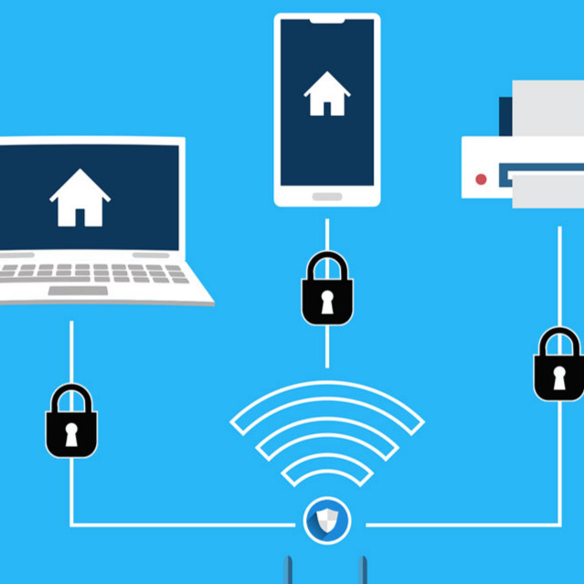

  

The main reasons I chose this project were not only to help my parents, but also to put into practice things I had learned in the classroom. At community college, I had just finished a two-series course of network and information technology, which included the basics of setting up, maintaining, and securing wifi networks. I had noticed at this time that the wifi at the two-story house my parents lived in was spotty at best and not very consistent. I found out that the reason for this was that there was a construction version of chicken wire all around the house, essentially making each floor and room a pseudo Faraday cage. 

In order to remedy this, I convinced my parents to get some new hardware, specifically, new routers and passthrough powerline devices. I used the new router as the new wifi network on the first floor (connected to the coaxial cable) and secured it by changing the wifi password as well as the admin router login credentials, helping prevent unauthorized access into the network. I then set the old router as a wireless access point on the second floor of the house and connected it to the new router using the powerline adapter. This allowed me to utilize the electrical wiring of the house to my advantage, where each router was able to provide service to its respective floors. 

My family noticed a change immediately upon rejoining the home network, as the service was more reliable all around the house, and due to the upgraded router, it was also faster. I found this task rewarding as well, since it helped solidify the skills I learned in class and apply them to a real-world situation.
