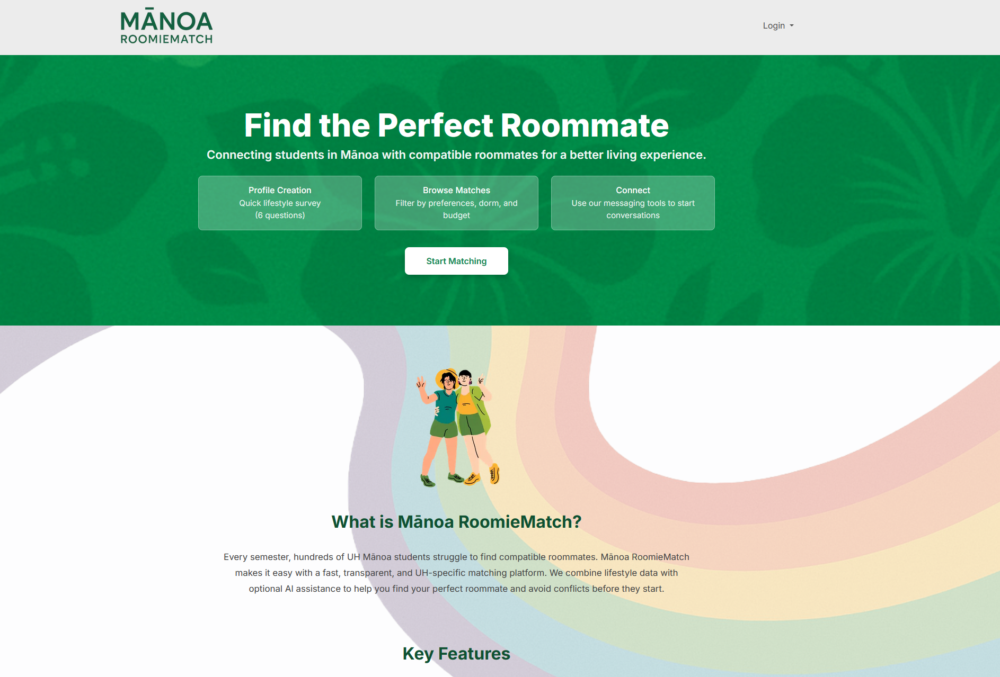

  

# Introduction
[Manoa RoomieMatch](https://manoaroomiematch.vercel.app/) is a web application that provides students at the University of Hawaii with AI-enhanced roommate matching. Students create an account using their UH email and fill out a lifestyle survey, covering sleep habits, cleanliness, and other aspects of roommate living. The application then compares user profiles to generate a compatibility score, along with an AI-generated explanation describing areas of alignment and potential conflict. These students can browse matches, view detailed comparisons, and connect with peers they’re compatible with. Progress was measured via "milestones," where each milestone was a new or updated iteration of the web application

# Personal Contributions

  
  

My contributions to this project spanned both front-end and back-end software development. On the front end, I designed the match compatibility page and updated the messaging page's design from mockup to implementation. On the backend, I developed the components for the match comparison page and its API routes, as well as the backend API routes for messaging functionality on the messaging page. I also helped update the Prisma database to hold the data for the messaging and compatibility pages, in addition to implementing a basic matching algorithm that calculated "compatibility scores" for all users whenever a new user joined or an existing user updated their lifestyle survey.  

Through Manoa RoomieMatch, I gained valuable experience working in collaboration with other members, in addition to strengthening my own software development abilities. Throughout each milestone, the backend components and API routes became increasingly more necessary so that pages could function together and ensure that data could be called from the Prisma database. This was challenging in terms of splitting work and communication, but by the third and final milestone, we had a fully functioning and cohesive application. From working on this project, I learned how to balance design and communication with teammates, in addition to developing a better sense of how to break down project problems into smaller pieces and avoid "code debt," or the accumulated cost of choosing quick and easy solutions in software development instead of better, long-term ones. This project also reinforced best practices in software engineering taught in class, including how to write proper code commits and how to work with others in navigating version control amongst the team.

# More Information
If you're interested in the team, milestone progress, or the project in general, please check out [our team's home page](https://manoaroomiematch.github.io/)!
